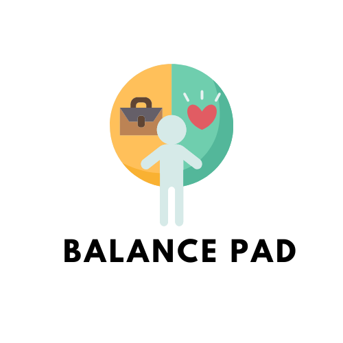

# Balance-Pad

 
 
.

## Try it out

https://affectionate-roentgen-40f333.netlify.app/

# What it does
Balance Pad is a web-based application that gives users access to **several resources** relating to mental health, education, and productivity. Its initial landing page is a dashboard tying everything together to make a clear and cohesive user experience. 

###Professional Help
> 1. _Chat Pad:_ The first subpage of the application has a built in _Chatbot_ offering direct access to a **mental heath professional** for instant messaging.

### Productivity
> 1. _Class Pad:_ With the use of the Assembly API, users can convert live lecture content into text based notes. This feature will allow students to focus on live lectures without the stress of taking notes. Additionally, this text to speech aide will increase accessibility for those requiring note takers. 
> 2. _Work Pad:_ Timed working sessions using the Pomodoro technique and notification restriction are also available on our webpage. The Pomodoro technique is a proven method to enhance focus on productivity and will benefit students
>3. _To Do Pad:_ Helps users stay organized

### Positivity and Rest
> 1.  _Affirmation Pad:_ Users can upload their accomplishments throughout their working sessions. Congratulatory texts and positive affirmations will be sent to the provided mobile number during break sessions!
> 2. _Break Pad:_  Offers options to entertain students while resting from studying. Users are given a range of games to play with and streaming options for fun videos!
 
### Information and Education
> 1. _Information Pad:_  is dedicated to info about all things mental health 
> 2. _Quiz Pad:_ This subpage tests what users know about mental health. By taking the quiz, users gain valuable insight into how they are and information on how to improve their mental health, wellbeing, and productivity.

# How we built it

**React:** Balance Pad was built using React. This allowed for us to easily combine the different webpages we each worked on. 

**JavaScript, HTML, and CSS:** React builds on these languages so it was necessary to gain familiarity with them

**Assembly API:** The assembly API was used to convert live audio/video into text

**Twilio:** This was used to send instant messages to users based on tracked accomplishments

# Challenges we ran into
> - Launching new apps with React via Visual Studio Code
> - Using Axios to run API calls
> - Displaying JSON information
> - Domain hosting of Class Pad
> - Working with Twilio

# Accomplishments that we're proud of
_Pranati:_ I am proud that I was able to learn React from scratch, work with new tech such as Axios, and successfully use the Assembly API to create the Class Pad (something I am passionate about). I was able to persevere through errors and build a working product that is impactful. This is my first hackathon and I am glad I had so much fun. 

_Simi:_ This was my first time using React, Node.js, and Visual Studio. I don't have a lot of CS experience so the learning curve was steep but rewarding! 

_Amitesh:_ Got to work with a team to bring a complicated idea to life!

# What we learned
_Amitesh:_  Troubleshooting domain creation for various pages, supporting teammates and teaching concepts

_Pranati:_ I learned how to use new tech such as React, new concepts such API calls using Axios, how to debug efficiently, and how to work and collaborate in a team

_Simi:_ I learned how APIs work, basic html, and how React modularizes code. Also learned the value of hackathons as this was my first

#What's next for Balance Pad
_Visualizing Music:_  Our group hopes to integrate BeatCaps software to our page in the future. This would allow a more interactive music experience for users and also allow hearing impaired individuals to experience music
_Real Time Transcription:_ Our group hopes to implement in real time transcription in the Class Pad to make it even easier for students. 

## Team members
- **Amitesh Kumar**
- **Pranati Dani**
- **Simi Jay**

 ### Contributors :
<!-- readme: contributors -start -->
<table>
<tr>
    <td align="center">
        <a href="https://github.com/belikeamitesh">
            
             
            <b>Amitesh Kumar</b>
        </a>
    </td>
    <td align="center">
        <a href="https://github.com/pranatidani-uw">
            
             
            <b>Pranati Dani</b>
        </a>
    </td>
    <td align="center">
        <a href="https://github.com/SimiJay">
            
             
            <b>Simi Jaya</b>
        </a>
    </td></tr>
</table>
<!-- readme: contributors -end -->
